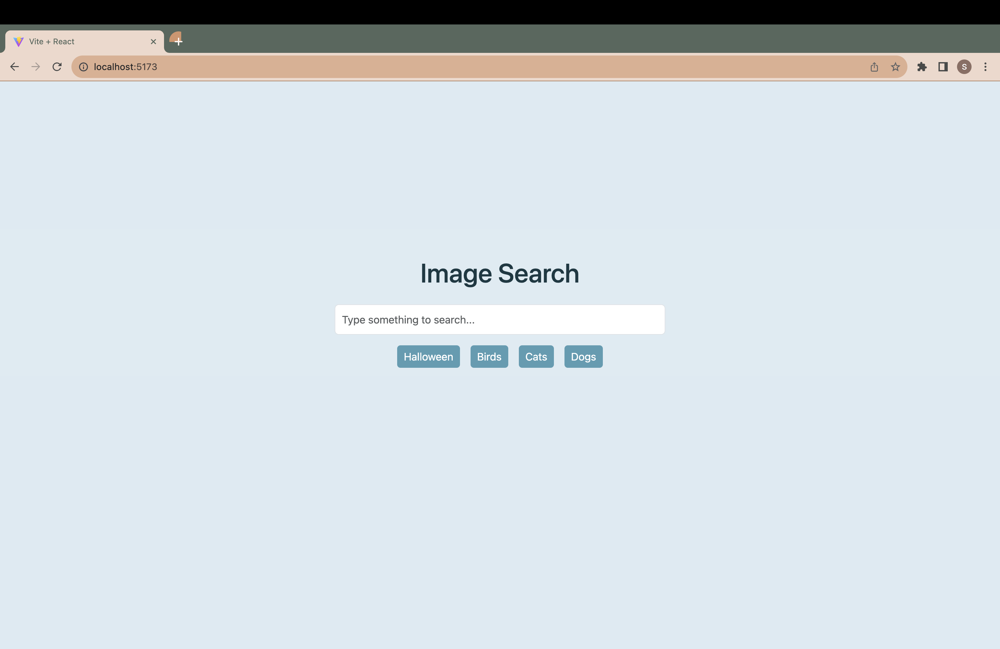
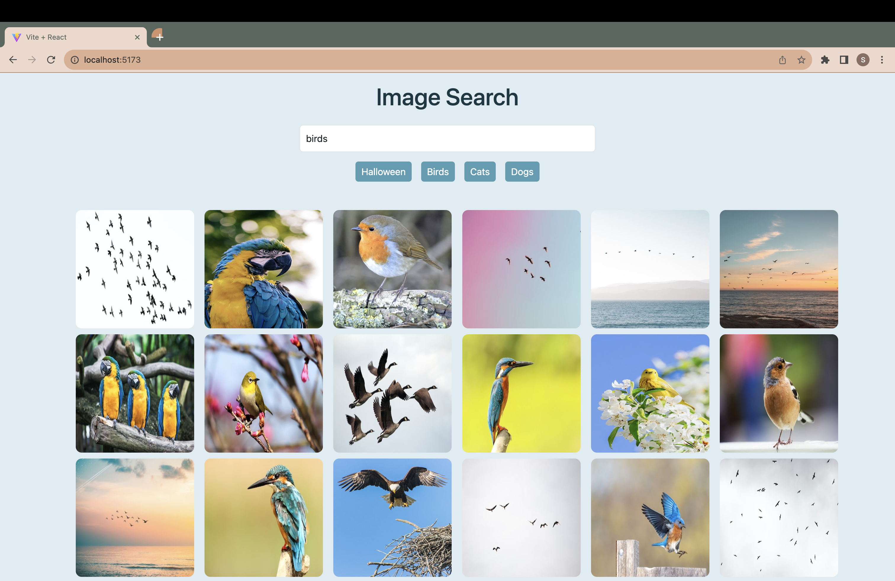

# Image Search App
- Frontend built using React and Vite.
- Unsplash boasts largest collection of high quality photos.
- Unsplash API, a simple JSON API helps integrate photos into the application.
- ESLint is used to spot application issues.
- Pagination implemented in React.
<h3 align="center">Application overview</h3>

 

 

 

 

 

## Tech Stack
- React.js |  Vite.js | API : Unsplash API | ESLint | Bootstrap

## To run this program
- Fork and Clone the repository.
- Run npm install to install all dependencies.
- Run npm run dev to start the server.
- Navigate to http://localhost:5173/ to see the application in action.

## Generation of API key for .env file
- Navigate to <a href="https://unsplash.com/developers" target="_blank">Unsplash for Developers</a>
- Click on 'Register aa a developer' button on the top right corner of the page.
- Create your account by entering all the necessary details.
- Once registered, you will be able to create a new application.
- Click on 'New Application' button. 
- Accept terms and then enter values for 'Application name' and 'Description'.
- Click 'Create Application' button.
- Scroll down to access key.
- Copy 'Access Key' and add it to .env file.

## Dependencies:
  - Node.js installed on your system
  - React, vite installed on your system
  - API key generated from Unsplash to be added to .env file

